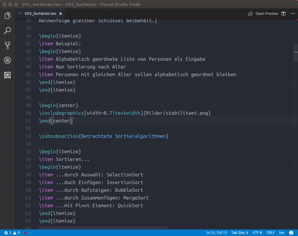

# latex-formatter

[](https://marketplace.visualstudio.com/items?itemName=nickfode.latex-formatter.svg)
[](https://marketplace.visualstudio.com/items?itemName=nickfode.latex-formatter)

LaTex-Formatter is a simple VSCode tool for the LaTex - Language



## Installation

### Package Manager

For MiKTeX and TeXLive there is a package available.

### Manually

> Reference for the following guide: [latexindent.pl - Documentation](https://github.com/cmhughes/latexindent.pl/tree/master/documentation)

#### Windows

1. go to [latexindent.pl](https://github.com/cmhughes/latexindent.pl) and download _latexindent.exe_, _defaultSettings.yaml_, _add-to-path.bat_ to the directory where you want to have **latexindent**.
2. right click on _add-to-path.bat_ and click _Run as administrator_.
3. log out and lock back in
4. open a command prompt type the following and hit enter
   ```bash
   echo %path%
   ```
   to check if **latexindent** is now in your **PATH**

#### Ubuntu/Debian

1. Go to [cmhughes/latexindent.pl](https://github.com/cmhughes/latexindent.pl) and download the _latexindent.pl_, _defaultSettings.yaml_ files to the directory where you want to have **latexindent** located.
2. Within this directory create a new directory called _path-helper-files_. In the GitHub repository navigate to the also named _path-helper-files_ directory and download its content to the local directory.
3. run the following commands
   ```bash
   sudo apt-get install cmake
   sudo apt-get update && sudo apt-get install build-essential
   mkdir build && cd build
   cmake ../path-helper-files
   sudo make install
   ```
4. run
   ```bash
   which latexindent.pl
   ```
   to check if **latexindent** was correctly installed

## Release Notes

### 1.0.5

Filenames with spaces are now supported

### 1.0.4

Add mac support

## Roadmap

* Style options
